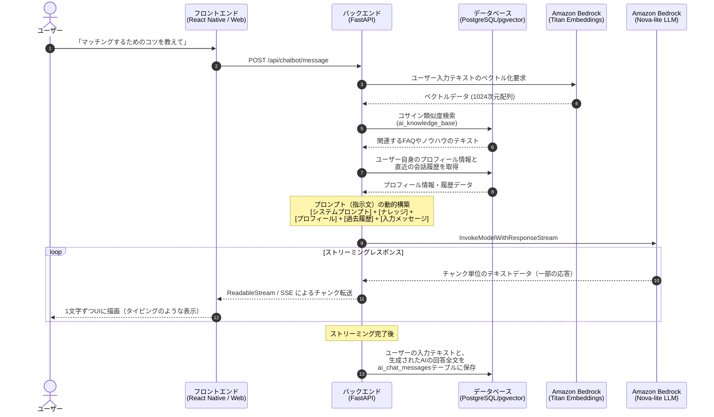

# AIコンシェルジュ アーキテクチャ図

アプリケーション内の各コンポーネントが、どのように連携してRAG（検索拡張生成）やストリーミング処理を実現するかを示すシーケンス図です。技術面接などでシステム全体の流れを説明する際に活用できます。

## 処理フロー (RAG + ストリーミング応答)

```mermaid
sequenceDiagram
    autonumber
    actor User as ユーザー
    participant Mobile as フロントエンド<br>(React Native / Web)
    participant FastAPI as バックエンド<br>(FastAPI)
    participant PGVector as データベース<br>(PostgreSQL/pgvector)
    participant Titan as Amazon Bedrock<br>(Titan Embeddings)
    participant Nova as Amazon Bedrock<br>(Nova-lite LLM)

    %% メッセージ送信とナレッジ検索
    User->>Mobile: 「マッチングするためのコツを教えて」
    Mobile->>FastAPI: POST /api/chatbot/message
    FastAPI->>Titan: ユーザー入力テキストのベクトル化要求
    Titan-->>FastAPI: ベクトルデータ (1024次元配列)

    %% RAG検索とユーザー情報取得
    FastAPI->>PGVector: コサイン類似度検索<br>(ai_knowledge_base)
    PGVector-->>FastAPI: 関連するFAQやノウハウのテキスト
    FastAPI->>PGVector: ユーザー自身のプロフィール情報と<br>直近の会話履歴を取得
    PGVector-->>FastAPI: プロフィール情報・履歴データ

    %% プロンプト構築と生成
    Note over FastAPI: プロンプト（指示文）の動的構築<br>[システムプロンプト] + [ナレッジ] +<br>[プロフィール] + [過去履歴] + [入力メッセージ]

    FastAPI->>Nova: InvokeModelWithResponseStream

    %% ストリーミング応答
    loop ストリーミングレスポンス
        Nova-->>FastAPI: チャンク単位のテキストデータ（一部の応答）
        FastAPI-->>Mobile: ReadableStream / SSE によるチャンク転送
        Mobile-->>User: 1文字ずつUIに描画（タイピングのような表示）
    end

    %% サブタスク（非同期保存）
    Note over FastAPI: ストリーミング完了後
    FastAPI->>PGVector: ユーザーの入力テキストと、<br>生成されたAIの回答全文を<br>ai_chat_messagesテーブルに保存
```
