# AWS Exchange App - データベースER図

このファイルは `schema.sql` から自動生成されたER図です。
`schema.sql` を更新した際は、必ずこのファイルも同期更新してください。

```mermaid
erDiagram
    %% ============================================================================
    %% Phase 1 (🔴P1) - MVP機能
    %% ============================================================================

    users ||--o| user_profiles : "has"
    users ||--o| user_ranks : "has"
    users ||--o{ matching_replies : "tracks"
    users ||--o{ matching_requests : "sends"
    users ||--o{ matching_requests : "receives"
    users ||--o{ chat_messages : "sends"
    users ||--o{ chat_messages : "receives"
    users ||--o{ meet_requests : "proposes"
    users ||--o{ meet_requests : "receives"
    users ||--o{ reviews : "writes"
    users ||--o{ reviews : "receives"
    users ||--o{ notifications : "receives"
    users ||--o{ footprints : "visits"
    users ||--o{ footprints : "is_visited_by"

    meet_requests ||--o| completed_meets : "completes"

    %% Phase 1 テーブル定義

    users {
        bigserial id PK "ユーザーID"
        varchar gender "性別"
        varchar phone_number "電話番号(UNIQUE)"
        varchar email "メールアドレス(UNIQUE)"
        varchar password_hash "パスワードハッシュ"
        timestamp created_at "作成日時"
        timestamp last_login "最終ログイン"
        timestamp last_active_at "最終アクティブ日時"
        timestamp last_logout_at "最終ログアウト日時"
        varchar presence_status "オンライン状態(online/logged_out)"
        varchar status "ステータス(active/inactive/banned)"
    }

    user_profiles {
        bigserial id PK "プロフィールID"
        bigint user_id FK "ユーザーID(UNIQUE)"
        varchar display_name "表示名"
        integer age "年齢"
        varchar location "所在地"
        text bio "自己紹介"
        varchar avatar_url "アイコンURL"
        integer icon_frame_id "アイコンフレームID"
        timestamp last_updated "更新日時"
    }

    user_ranks {
        bigserial id PK "ランクID"
        bigint user_id FK "ユーザーID(UNIQUE)"
        integer current_rank "現在のランク(1-5)"
        integer meets_count "デート実施回数"
        numeric reply_rate "返信率(%)"
        numeric review_avg "レビュー平均点"
        integer manner_points "マナーポイント"
        timestamp last_rank_update "ランク更新日時"
        timestamp promoted_at "昇格日時"
        timestamp demoted_at "降格日時"
    }

    matching_replies {
        bigserial id PK "返信記録ID"
        bigint user_id FK "ユーザーID"
        integer accepted_count "承認数"
        integer replied_count "返信数"
        timestamp period_date "集計期間"
    }

    matching_requests {
        bigserial id PK "マッチングID"
        bigint from_user_id FK "送信元ユーザーID"
        bigint to_user_id FK "送信先ユーザーID"
        varchar status "ステータス(pending/accepted/rejected)"
        timestamp created_at "作成日時"
    }

    chat_messages {
        bigserial id PK "メッセージID"
        bigint sender_id FK "送信者ID"
        bigint receiver_id FK "受信者ID"
        text message "メッセージ本文"
        timestamp sent_at "送信日時"
        boolean is_read "既読フラグ"
    }

    meet_requests {
        bigserial id PK "デート予約ID"
        bigint from_user_id FK "提案者ID"
        bigint to_user_id FK "相手ID"
        date scheduled_date "予定日"
        time scheduled_time "予定時刻"
        double meet_latitude "待ち合わせ緯度"
        double meet_longitude "待ち合わせ経度"
        varchar status "ステータス(pending/accepted/rejected/completed)"
        timestamp created_at "作成日時"
        varchar qr_token_a "QRトークンA"
        varchar qr_token_b "QRトークンB"
        timestamp qr_scanned_at "QRスキャン日時"
    }

    completed_meets {
        bigserial id PK "完了デートID"
        bigint meet_request_id FK "デート予約ID(UNIQUE)"
        timestamp completed_at "完了日時"
    }

    reviews {
        bigserial id PK "レビューID"
        bigint reviewer_id FK "レビュワーID"
        bigint reviewed_id FK "レビュー対象ID"
        integer rating "評価(1-5)"
        text comment "コメント"
        timestamp created_at "作成日時"
    }

    notifications {
        bigserial id PK "通知ID"
        bigint user_id FK "ユーザーID"
        text content "通知内容"
        varchar type "通知タイプ(match/message/meet/review/system)"
        boolean is_read "既読フラグ"
        timestamp created_at "作成日時"
    }

    footprints {
        bigserial id PK "足跡ID"
        bigint visitor_id FK "訪問者ID"
        bigint visited_id FK "訪問先ID"
        timestamp viewed_at "閲覧日時"
    }

    %% ============================================================================
    %% Phase 2 (🟠P2) - 拡大機能
    %% ============================================================================

    users ||--o{ boost_purchases : "purchases"
    users ||--o| premium_subscriptions : "subscribes"
    users ||--o| receive_filters : "has"
    users ||--o{ icon_frame_purchases : "purchases"
    users ||--o{ message_quotas : "has"
    users ||--o{ boost_display_logs : "has"

    icon_frames ||--o{ icon_frame_purchases : "purchased_as"
    boost_purchases ||--o{ boost_display_logs : "logged_in"

    boost_purchases {
        bigserial id PK "ブーストID"
        bigint user_id FK "ユーザーID"
        timestamp purchased_at "購入日時"
        timestamp activated_at "有効化日時"
        timestamp expires_at "有効期限"
        integer price_jpy "価格(円)"
        varchar payment_status "支払いステータス(pending/completed/failed)"
        integer bonus_messages_total "追加メッセージ総数(デフォルト10)"
        integer bonus_messages_used "使用済み追加メッセージ数"
    }

    premium_subscriptions {
        bigserial id PK "プレミアムID"
        bigint user_id FK "ユーザーID(UNIQUE)"
        timestamp started_at "開始日時"
        timestamp ends_at "終了日時"
        varchar status "ステータス(active/canceled/expired)"
        integer monthly_price_jpy "月額料金(円)"
        timestamp last_charge_at "最終課金日時"
        timestamp next_charge_at "次回課金日時"
    }

    receive_filters {
        bigserial id PK "フィルターID"
        bigint user_id FK "ユーザーID(UNIQUE)"
        boolean block_rank1 "ランク1ブロック"
        boolean block_rank2 "ランク2ブロック"
        boolean block_rank3 "ランク3ブロック"
        boolean tribute_filter_enabled "貢ぎフィルター有効"
        timestamp created_at "作成日時"
        timestamp updated_at "更新日時"
    }

    icon_frames {
        bigserial id PK "フレームID"
        varchar name "フレーム名"
        text description "説明"
        varchar image_url "画像URL"
        integer price_jpy "価格(円)"
        boolean is_free "無料フラグ"
        varchar rarity "レアリティ(common/rare/epic/legendary)"
        timestamp created_at "作成日時"
    }

    icon_frame_purchases {
        bigserial id PK "購入ID"
        bigint user_id FK "ユーザーID"
        bigint frame_id FK "フレームID"
        timestamp purchased_at "購入日時"
        integer price_jpy "購入価格(円)"
        varchar payment_status "支払いステータス(pending/completed/failed)"
    }

    message_quotas {
        bigserial id PK "クォータID"
        bigint user_id FK "ユーザーID"
        date quota_date "集計日"
        integer base_quota "基本枠"
        integer boost_quota "ブースト枠"
        integer premium_quota "プレミアム枠"
        integer used_count "使用数"
        timestamp created_at "作成日時"
        timestamp updated_at "更新日時"
    }

    boost_display_logs {
        bigserial id PK "表示ログID"
        bigint user_id FK "ユーザーID"
        bigint boost_id FK "ブーストID"
        varchar display_rank "表示ランク"
        integer display_position "表示位置"
        timestamp start_time "開始時刻"
        timestamp end_time "終了時刻"
        integer impressions "表示回数"
        integer clicks "クリック数"
        timestamp created_at "作成日時"
    }

    %% ============================================================================
    %% Phase 3 (🟡P3) - 収益化機能
    %% ============================================================================

    users ||--o{ live_streams : "broadcasts"
    users ||--o{ fanclub_memberships : "subscribes_to"
    users ||--o{ fanclub_memberships : "creates"
    users ||--o{ call_tickets : "sells"
    users ||--o{ call_ticket_purchases : "buys"
    users ||--o{ call_ticket_purchases : "sells_to"
    users ||--o{ gifts : "sends"
    users ||--o{ gifts : "receives"
    users ||--o{ tipping_transactions : "sends"
    users ||--o{ tipping_transactions : "receives"
    users ||--o{ monthly_revenue : "earns"

    live_streams ||--o{ tipping_transactions : "receives"
    call_tickets ||--o{ call_ticket_purchases : "purchased_as"

    live_streams {
        bigserial id PK "配信ID"
        bigint broadcaster_id FK "配信者ID"
        timestamp started_at "開始日時"
        timestamp ended_at "終了日時"
        varchar title "配信タイトル"
        integer viewer_count "視聴者数"
        varchar status "ステータス(live/ended/archived)"
        integer total_tipping_jpy "総投げ銭額(円)"
    }

    fanclub_memberships {
        bigserial id PK "会員ID"
        bigint member_id FK "会員ユーザーID"
        bigint creator_id FK "クリエイターID"
        timestamp joined_at "加入日時"
        timestamp expires_at "有効期限"
        varchar status "ステータス(active/canceled/expired)"
        integer monthly_price_jpy "月額料金(円)"
        timestamp next_charge_at "次回課金日時"
    }

    call_tickets {
        bigserial id PK "チケットID"
        bigint seller_id FK "販売者ID"
        integer ticket_duration_minutes "通話時間(分)"
        integer price_jpy "価格(円)"
        boolean is_available "販売中フラグ"
        timestamp created_at "作成日時"
    }

    call_ticket_purchases {
        bigserial id PK "購入ID"
        bigint buyer_id FK "購入者ID"
        bigint ticket_id FK "チケットID"
        bigint seller_id FK "販売者ID"
        timestamp purchased_at "購入日時"
        timestamp used_at "使用日時"
        integer amount_jpy "購入金額(円)"
    }

    gifts {
        bigserial id PK "ギフトID"
        bigint sender_id FK "送信者ID"
        bigint recipient_id FK "受信者ID"
        integer gift_item_id "ギフトアイテムID"
        timestamp sent_at "送信日時"
        timestamp received_at "受信日時"
        boolean is_opened "開封済みフラグ"
        integer price_jpy "価格(円)"
    }

    tipping_transactions {
        bigserial id PK "取引ID"
        bigint sender_user_id FK "送信者ID"
        bigint recipient_user_id FK "受信者ID"
        bigint live_stream_id FK "配信ID"
        integer amount_jpy "金額(円)"
        varchar status "ステータス(pending/completed/failed)"
        timestamp occurred_at "発生日時"
        timestamp settled_at "精算日時"
        integer creator_revenue_jpy "クリエイター収益(円)"
        integer platform_revenue_jpy "プラットフォーム収益(円)"
    }

    monthly_revenue {
        bigserial id PK "月次売上ID"
        bigint user_id FK "ユーザーID"
        varchar year_month "年月(YYYY-MM)"
        integer boost_revenue_jpy "ブースト売上(円)"
        integer premium_revenue_jpy "プレミアム売上(円)"
        integer fanclub_revenue_jpy "ファンクラブ売上(円)"
        integer gift_revenue_jpy "ギフト売上(円)"
        integer tipping_revenue_jpy "投げ銭売上(円)"
        integer ticket_revenue_jpy "チケット売上(円)"
        integer total_revenue_jpy "総売上(円)"
        integer creator_payout_70_jpy "クリエイター配分70pct(円)"
        integer platform_payout_30_jpy "プラットフォーム配分30pct(円)"
        timestamp settled_at "精算日時"
    }

    user_statistics {
        bigserial id PK "統計ID"
        date date "集計日(UNIQUE)"
        integer dau "日次アクティブユーザー数"
        integer matched_pairs "マッチング成立数"
        integer completed_meets "デート完了数"
        integer total_users "総ユーザー数"
        numeric avg_arpu "平均ARPU"
        timestamp created_at "作成日時"
    }
```

## テーブル構成サマリー

### 🔴 Phase 1 (MVP機能) - 11テーブル

- `users` - ユーザー基本情報
- `user_profiles` - プロフィール詳細
- `user_ranks` - ランクシステム
- `matching_replies` - 返信率追跡
- `matching_requests` - マッチング依頼
- `chat_messages` - チャット
- `meet_requests` - デート予約
- `completed_meets` - 完了デート
- `reviews` - レビュー
- `notifications` - 通知
- `footprints` - 足跡

### 🟠 Phase 2 (拡大機能) - 8テーブル

- `boost_purchases` - ブースト購入
- `premium_subscriptions` - プレミアム会員
- `receive_filters` - 受信フィルター
- `icon_frames` - アイコンフレーム
- `icon_frame_purchases` - フレーム購入履歴
- `message_quotas` - メッセージ上限管理
- `boost_display_logs` - ブースト表示ログ

### 🟡 Phase 3 (収益化機能) - 7テーブル

- `live_streams` - ライブ配信
- `fanclub_memberships` - ファンクラブ
- `call_tickets` - 通話チケット
- `call_ticket_purchases` - チケット購入履歴
- `gifts` - ギフト
- `tipping_transactions` - 投げ銭取引
- `monthly_revenue` - 月次売上集計

**総テーブル数: 26テーブル**
