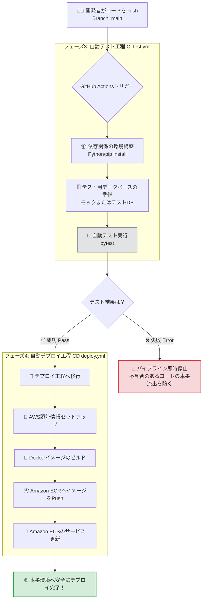

# CI/CD パイプライン ワークフロー図

自動テスト（CI）から自動デプロイ（CD）までの流れを可視化したフロー図です。
GitHubにコードをPushした際、どのような順番でテストとデプロイが行われるかを示しています。

## 各工程の解説

1. **🧑‍💻 Push**: あなたが手元で修正したコードを `main` ブランチにPushすると、GitHubがそれを検知して自動的にプロセス（Workflow）を開始します。
2. **🧪 テスト工程 (CI)**: `test.yml` という設定ファイルに基づいて、GitHubのサーバー上であなたの書いたバックエンドのプログラムが立ち上がり、Pytest（自動テスト）が実行されます。
3. **🛑 防止機能**: もし誰かがバグの混入したコードをPushしてしまった場合、テスト工程で「失敗（❌）」となり、**その時点でデプロイ処理は強制キャンセル**されます。これにより、本番環境が壊れるのを未然に防ぎます。
4. **🚀 デプロイ工程 (CD)**: テストが「100%成功（✅）」した場合のみ、すでに作成済みの `deploy.yml` の処理が動き出し、AWSのECSへと新しいコンテナが自動的に展開されます。
